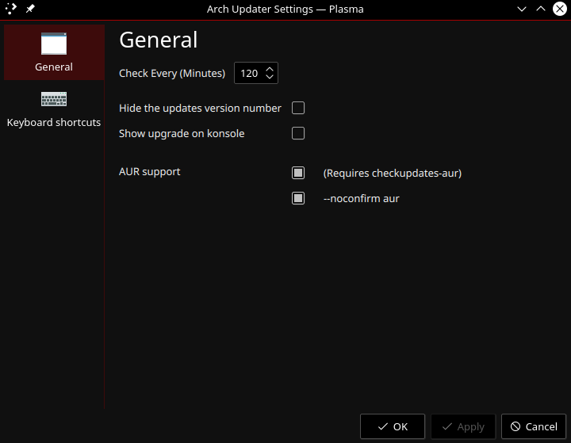

# KDE Plasmoid Arch Linux Updates Notification
A KDE plasmoid for your system tray that notifies you of available updates for your Arch Linux System

In your system tray:

Full Representation:

Settings:

# Requires:
* Arch Linux
* KDE desktop environment
* cmake
* extra-cmake-modules
* make
* gcc
* fakeroot
*
# How to install
run ./install_plasmoid.sh

right click task bar

select panel options

select add widget

double click arch updater
